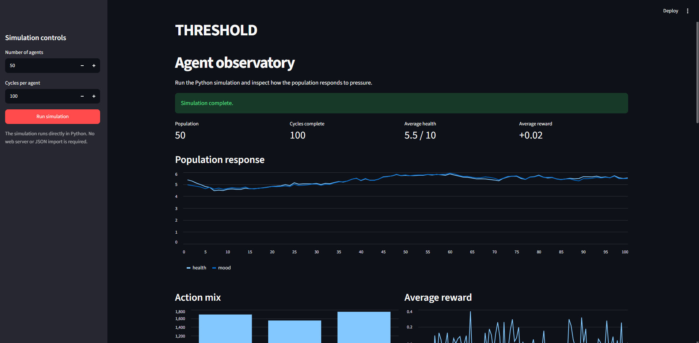

# Threshold

A multi-agent simulation exploring how a diverse population responds to a single shared event. ~50 agents, each with their own traits (health, savings, risk tolerance, social support, disease), all get hit by the same shock, but react differently based on their own "threshold" for how much a disturbance actually affects them. Each agent learns its own behavior over time using tabular Q-learning instead of following scripted if-else rules.

The goal is to see emergent, diverse patterns in collective behavior arising purely from individual differences reacting to one shared cause.



## How it works

Every cycle, an agent:

1. Gets hit by a randomly generated shock (an intensity value)
2. Calculates its own **threshold** from its traits (health, risk tolerance, savings, social support, disease) - basically how resilient it currently is
3. Compares shock intensity to threshold to get an **impact** value (0 if it can absorb the shock, a positive number if it can't)
4. Picks an **action** (Ignore, Reduce Consumption, or Seek Support) using epsilon-greedy - explore randomly early on, increasingly rely on its own learned Q-table as training goes on
5. The chosen action reduces the impact by a different amount depending on the agent's traits (e.g. Seek Support works better with high social support)
6. Health and mood get updated based on the reduced impact, with a small per-cycle recovery that also depends on traits
7. A reward is calculated from the change in health/mood minus the cost of the action taken
8. The agent updates its own Q-table using the Bellman equation, based on the state it was in, the action it took, the reward it got, and the state it ended up in

Each agent keeps repeating this for however many cycles it's run for, learning its own policy independently of every other agent.

## State representation

State is just an agent's (health, mood) bucketed into 5 tiers each, giving 25 possible states per agent. Savings, social support, and disease aren't part of the state directly - they're already baked into how effective each action is and what reward comes out of it, so the agent doesn't need to separately observe them to benefit from having them.

## Project structure

```
agents/
  agent.py        - Agent class: traits, threshold, impact, action effects, state update, reward, Q-table
  population.py   - random agent generation, the main simulation loop
  constants.py    - all tunable constants and lookup tables (action costs, disease weights, Q-learning hyperparameters, etc.)
simulation/
  simulation.py   - records cycle results for the dashboard without changing agent behavior
streamlit/
  app.py          - Streamlit dashboard for running and visualizing simulations
example/
  frozen_lake.py  - separate FrozenLake Q-learning example
```

## Installing dependencies

From the project root, install the dependencies:

```powershell
pip install -r requirements.txt
```

If you are using the included Windows virtual environment:

```powershell
.\.venv\Scripts\Activate.ps1
pip install -r requirements.txt
```

## Running the Streamlit dashboard

Start the dashboard from the project root:

```powershell
streamlit run streamlit/app.py
```

If the `streamlit` command is not found, run it through the virtual environment directly:

```powershell
.\.venv\Scripts\streamlit.exe run streamlit/app.py
```

Streamlit will print a local URL, usually:

```text
http://localhost:8501
```

Open that URL in your browser. In the sidebar, choose the number of agents and cycles, then click **Run simulation**. The simulation runs directly in Python and the dashboard displays the population trends, action mix, rewards, individual histories, and Q-tables.

## Running the simulation from the command line

To run the simulation without the dashboard:

```powershell
python -m agents.population
```

This runs the default population and cycle count from `agents/constants.py`.

## The Streamlit dashboard

The `screenshot.png` above is from a Streamlit dashboard that sits on top of the simulation and lets you run it with a chosen number of agents and cycles, then visualize the results: population-wide health/mood trends, the mix of actions taken, average reward over time, and a per-agent breakdown including their actual learned Q-table.

The Streamlit UI itself was built with AI assistance since it's purely a visualization layer. All of the simulation logic underneath it (the Agent class, the Q-learning loop, the reward/threshold/impact design) was written by hand.

## Status

The core backend simulation is functional: agents generate, get hit by shocks, choose actions via epsilon-greedy, and learn via tabular Q-learning with decaying epsilon. Running with a larger population and more cycles shows genuinely different trajectories across agents, with some stabilizing at high health/mood and others staying stuck lower, depending on their traits.

Still open for later: quantitative diversity metrics across the population, Q-table persistence (save/resume training), hyperparameter tuning, and expanding the trait/shock design beyond the current trimmed set.
